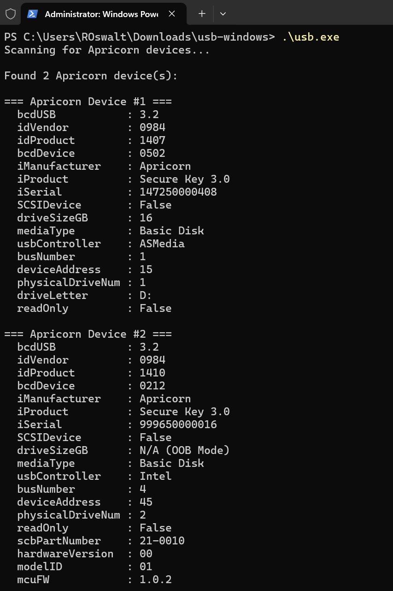

# usb-tool (Apricorn USB Utility)

Cross-platform CLI and Python library for enumerating Apricorn USB devices and performing a safe READ(10) diagnostic poke.

- Windows, Linux: enumeration + optional poke (requires Admin/root)
- macOS: enumeration only (poke planned)

## Download (standalone builds)

Prebuilt installers and single-file binaries are published on GitHub Releases; Python is not required.

1. Download the latest asset for your OS:
   - **Windows**: `usb-tool-<version>-x64.msi` installs to `%ProgramFiles%\Apricorn\usb-tool\` and places `usb` on PATH (Admin required).
   - **Linux**: `usb-tool-<version>-amd64.deb` installs to `/usr/local/lib/usb-tool` and symlinks `/usr/local/bin/usb` (sudo required).<br>
                A portable `usb-linux.tar.gz` plus `installers/linux/install.sh` is available for non-Debian hosts.
   - **macOS**: `usb-tool-<version>-macos.pkg` installs to `/usr/local/lib/usb-tool` and exposes `/usr/local/bin/usb`; the payload is universal. A raw `usb-macos.tar.gz` binary is also published for portable use.
2. Run `usb` from a terminal with the commands below. Poke still requires Administrator on Windows and sudo/root on Linux.
3. To update standalone builds, rerun the latest installer or download the newest portable binary. Standalone binaries do not use `usb-update`.

Detailed installer instructions (silent installs, manual uninstall, etc.) live in `INSTALLERS.md`.

## Install via pip

Recommended with Python 3.10+.

1. (Optional) create a virtual environment
   ```bash
   python -m venv .venv
   # Windows
   .venv\Scripts\activate
   # Linux/macOS
   source .venv/bin/activate
   ```
2. Install
   ```bash
   pip install .
   ```
3. For development
   ```bash
   pip install -e .[dev]
   pre-commit install
   ```

## Usage

List Apricorn devices (VID 0984):
```bash
usb
```



<br>
"Poke" device (make Green LED blink):

- Windows (Admin shell): target by index or `all`
  ```bash
  usb -p 1
  usb -p 1,3
  usb -p all
  ```
- Linux (sudo/root): target by index, block path, or `all`
  ```bash
  sudo usb -p 1
  sudo usb -p /dev/sdb
  sudo usb -p all
  ```

Script-friendly JSON:
```bash
usb --json
```
Outputs a deterministic structure tailored for automation:
```json
{
  "devices": [
    {
      "1": {
        "bcdUSB": 3.2,
        "idVendor": "0984",
        "idProduct": "1407",
        "bcdDevice": "0502",
        "iManufacturer": "Apricorn",
        "iProduct": "Secure Key 3.0",
        "iSerial": "147250000408",
        "SCSIDevice": false,
        "driveSizeGB": 16,
        "mediaType": "Basic Disk",
        "usbController": "Intel",
        "busNumber": 1,
        "deviceAddress": 16,
        "physicalDriveNum": 3,
        "driveLetter": "F:",
        "readOnly": false,
        "scbPartNumber": "N/A",
        "hardwareVersion": "N/A",
        "modelID": "N/A",
        "mcuFW": "N/A"
      }
    }
  ]
}
```
If no devices are detected, `"devices"` is an empty list. This mode cannot be combined with `--poke`.

## Output Fields

The CLI prints normalized device fields. Typical keys include:
- `bcdUSB`: USB spec version (e.g., 2.0, 3.0)
- `idVendor`, `idProduct`: vendor/product IDs (lowercase hex)
- `bcdDevice`: device revision (4-hex digits)
- `iManufacturer`, `iProduct`, `iSerial`: user-friendly descriptors
- `SCSIDevice`: whether UAS/SCSI is in use
- `driveSizeGB`: normalized capacity or `N/A (OOB Mode)`
- `usbController`: Windows only (e.g., Intel, ASMedia)
- Platform identifiers: Windows physical drive number, Linux block path, macOS disk path

Version details (best-effort, safely parsed from a vendor READ BUFFER):
- `scbPartNumber`, `hardwareVersion`, `modelID`, `mcuFW`

Visibility rules:
- The tool always hides `bridgeFW` from user output.
- If `bridgeFW` does not match `bcdDevice`, the version fields listed above are omitted.
- Devices reporting no size (OOB Mode) are automatically skipped for poke.

## Platform Notes

**Windows**
- Enumeration works as standard user; poke requires Administrator.
- Requires PowerShell in `PATH`. `libusb` and `pywin32` are pinned and installed via markers.

**Linux**
- Full detail may require root. Helpful tools: `lsusb`, `lshw`, `lsblk`.
- Optional helper: run `./update_sudoersd.sh` to allow passwordless reads for `lshw`/`fdisk -l` (review before using).

**macOS**
- Enumeration uses `system_profiler` + `ioreg`. Poke is not yet enabled.
- For tests/tools: `brew install lsusb`.

## Python API

`find_apricorn_device()` is exported for convenience:
```python
from usb_tool import find_apricorn_device

devices = find_apricorn_device() or []
for dev in devices:
    print(dev.iProduct, dev.iSerial, dev.driveSizeGB)
```

Returned objects are dataclasses:
- Windows: `WinUsbDeviceInfo`
- Linux: `LinuxUsbDeviceInfo`
- macOS: `macOSUsbDeviceInfo`

Field sets are similar across OSes; some fields are platform-specific (e.g., `usbController` on Windows, `blockDevice` on Linux). Output filtering described above applies only to CLI printing; collected fields remain available on the objects.

## Contributing / Dev

- Code style: `black` + `ruff` via pre-commit.
- Tests: `pytest -q`.
- Python 3.10+.
